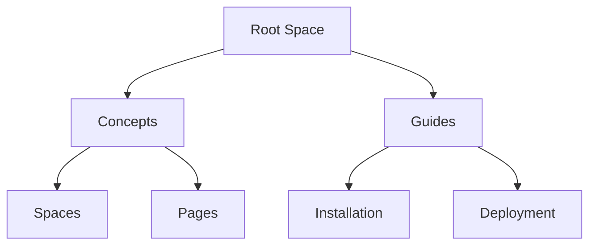

## Overview

Netra organizes your project documentation into flexible spaces. You create spaces to group related docs, build page hierarchies for navigation, integrate version control for changes, and enable team collaboration. These concepts form the foundation for effective documentation management.

<Columns cols={2}>
  <Card title="Spaces" icon="database" href="/docs/spaces">
    Group docs by project or team.
  </Card>
  <Card title="Pages" icon="file-text" href="/docs/pages">
    Structure content with hierarchies.
  </Card>
  <Card title="Versions" icon="git-branch" href="/docs/versions">
    Track changes over time.
  </Card>
  <Card title="Collaboration" icon="users" href="/docs/collaboration">
    Work together seamlessly.
  </Card>
</Columns>

## Documentation Spaces and Structure

Spaces act as containers for your documentation. You define a space for each project, like "API Reference" or "User Guide". Each space holds pages, supports custom navigation, and integrates with version control.

<Steps>
  <Step title="Create a Space" icon="plus">
    Navigate to the Spaces dashboard and click "New Space". Enter a name like "Netra API Docs" and select a brand color such as `#3B82F6`.
  </Step>
  <Step title="Configure Settings" icon="settings">
    Set permissions, enable version control, and add a description: "Official docs for Netra's documentation system."
  </Step>
  <Step title="Add Pages" icon="file-plus">
    Create your first page, such as `concepts.mdx`, to start building content.
  </Step>
</Steps>

<Callout kind="tip">
  Use spaces to separate public user docs from internal developer guides.
</Callout>

## Page Organization and Hierarchies

You organize pages into nested hierarchies for intuitive navigation. Frontmatter defines metadata, while MDX components enhance structure.

<Tabs>
  <Tab title="Flat Structure" icon="layers">
    Ideal for simple sites.

    ```
    /docs/
    ├── overview.mdx
    ├── quickstart.mdx
    └── api.mdx
    ```
  </Tab>
  <Tab title="Nested Hierarchy" icon="folder">
    Supports deep navigation.

    ```
    /docs/
    ├── concepts/
    │   ├── spaces.mdx
    │   └── pages.mdx
    └── guides/
        ├── installation.mdx
        └── deployment.mdx
    ```
  </Tab>
</Tabs>



## Version Control Basics

Netra integrates Git for version control. You commit changes, create branches, and merge updates directly from the editor.

<CodeGroup tabs="Git CLI,Netra UI">
  ```bash
  # Clone your space repo
  git clone https://git.netra.com/your-team/api-docs.git
  cd api-docs

  # Make changes and commit
  git add concepts.mdx
  git commit -m "Add core concepts page"
  git push origin main
  ```
  ```bash
  # In Netra UI: Click "Commit Changes"
  # Enter message: "Update hierarchies section"
  # Select branch: main
  # Click "Push"
  ```
</CodeGroup>

## Collaboration Workflows

Teams collaborate through real-time editing, reviews, and notifications. Assign roles like Editor or Viewer.

<ExpandableGroup>
  <Expandable title="Review Workflow" default-open="true">
    1. Create a draft branch.
    2. Share the preview link.
    3. Request reviews via `@mentions`.
    4. Merge after approvals.
  </Expandable>
  <Expandable title="Advanced Permissions">
    Customize access: Owners manage spaces, Editors update pages, Viewers read only.
  </Expandable>
</ExpandableGroup>

<Callout kind="info">
  Enable notifications in space settings to stay updated on changes.
</Callout>