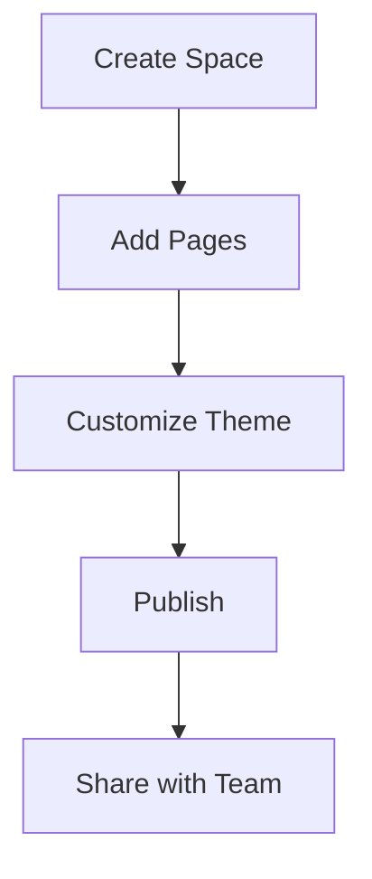

## Overview

Netra Documentation helps you create, organize, and manage documentation spaces for your projects. You build centralized hubs for technical guides, API references, and team knowledge without scattered files or outdated wikis. Use intuitive MDX-powered editing to craft rich pages with interactive components like steps, tabs, and code examples.

<Callout kind="info">
Netra supports unlimited documentation spaces, so you organize docs by project, product, or team.
</Callout>

## Key Features

Netra offers powerful tools to streamline your documentation workflow.

<Columns cols={3}>
  <Card title="Interactive Components" icon="components" href="/docs/components">
    Embed steps, tabs, cards, and diagrams directly in MDX for engaging guides.
  </Card>
  <Card title="Version Control" icon="git-branch" href="/docs/versioning">
    Track changes with Git integration and preview updates before publishing.
  </Card>
  <Card title="Search & Navigation" icon="search" href="/docs/search">
    Full-text search and automatic sidebar navigation keep users oriented.
  </Card>
</Columns>

## Getting Started

Follow these steps to set up your first documentation space.

<Steps>
  <Step title="Create a Space" icon="plus">
    Log in to Netra and click **New Space**. Enter a name like `My Project Docs` and select your brand color (`#3B82F6`).
  </Step>
  <Step title="Add Pages" icon="file-plus">
    Create `introduction.mdx` as your landing page. Use the MDX editor to add content.
  </Step>
  <Step title="Customize Theme" icon="palette">
    Go to **Settings > Theme** and set primary color to `#3B82F6`. Preview changes live.
  </Step>
  <Step title="Publish" icon="globe">
    Click **Publish** to make your space live. Share the URL with your team.
  </Step>
</Steps>

## Multi-Language Support

Switch between languages seamlessly with tabbed examples.

<Tabs>
  <Tab title="JavaScript" icon="code">
    ```javascript
    // Fetch docs from Netra API
    const response = await fetch('https://api.netra-docs.com/spaces/my-project/pages');
    const pages = await response.json();
    console.log(pages);
    ```
  </Tab>
  <Tab title="Python" icon="python">
    ```python
    # Fetch docs using requests
    import requests
    response = requests.get('https://api.netra-docs.com/spaces/my-project/pages')
    pages = response.json()
    print(pages)
    ```
  </Tab>
</Tabs>

## Brand Guidelines

Follow these rules to maintain consistency across your docs.

<ExpandableGroup>
  <Expandable title="Colors" default-open="true">
    Use primary blue `#3B82F6` for links and accents. Pair with neutral grays for text.
  </Expandable>
  <Expandable title="Typography">
    Headings use bold sans-serif. Body text is 16px with 1.5 line height.
  </Expandable>
  <Expandable title="Icons">
    Stick to Lucide icons like `book-open` for docs or `zap` for features.
  </Expandable>
</ExpandableGroup>

<CodeGroup tabs="MDX,Markdown">
```mdx
// MDX example with components
<Callout kind="tip">Pro tip here.</Callout>
```
```markdown
<!-- Plain Markdown fallback -->
> Pro tip here.
```
</CodeGroup>



You now have a fully functional documentation space. Explore advanced features like API integrations and custom domains next.